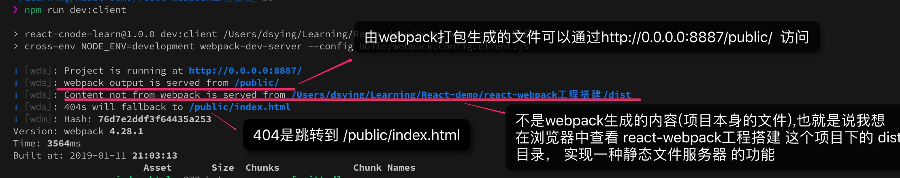

# React + Webpack 搭建工程 总结

## 目录结构

### build

+ 配置文件
+ webpack的 config文件
+ 其它工程需要用到的脚本文件

### client

+ 前端的文件

## WebPack 配置

### webpack.config.js

```js
//entry: 入口文件
    entry: {
        app: path.join(__dirname, '../client/app.js')
    }
```

#### publicPath: '/public/'

    /public 后面必须 有 /

```js
//output: 输出文件
    output: {
        filename: '[name].[hash].js',
        path: path.join(__dirname, '../dist'),//输出目录，默认为dist
        publicPath: '/public', //html 引用打包后的js时，url的前缀, 静态文件的 基础路径
        libraryTarget: 'commonjs2'//模块打包机制 当用 Webpack 去构建一个可以被其他模块导入使用的库时需要用到它
    }
```

```js
//loader处理当前代码
    module: {
        rules: [
            {   //将jsx转换成 js
                test: /.jsx$/,
                loader: 'babel-loader'
            },
            {   //将ES6语法转成 低版本语法
                test: /.js$/,
                loader: 'babel-loader',
                exclude: [//排除node_modules 下的js
                    path.join(__dirname,'../node_modules')
                ]
            }
        ]
    }
```

```js
//插件
    plugins: [
        // 生成一个html页面，同时把所有 entry打包后的 output 文件全部注入到这个html页面
        new HTMLPlugin({
            template: path.join(__dirname, '../client/template.html')
        })
    ]
```

### .babelrc 配置

```sh
yarn add babel-loader @babel/core @babel/preset-env @babel/preset-react --dev
```

```js
{
    "presets": [ "@babel/preset-env", "@babel/preset-react" ],
    "plugins": [
        "react-hot-loader/babel"
    ]
}
```

+ @babel/core
+ @babel/preset-env: 处理ES6语法
+ @babel/preset-react: 处理react语法

[babel 升级到7.X采坑总结](https://segmentfault.com/a/1190000016458913)

### webpack-dev-server启动一个开发服务器

在开发阶段，我们借用devServer启动一个开发服务器进行开发，这里也会配置一个publicPath，这里的publicPath路径下的打包文件可以在浏览器中访问。而静态资源仍然使用output.publicPath。

webpack-dev-server打包的内容是放在内存中的，这些打包后的资源对外的的根目录就是publicPath，换句话说，这里我们设置的是打包后资源存放的位置

```js
//
if(isDev){
    config.devServer = {
        hots: '0.0.0.0',
        port: '8888',
        contentBase: path.join(__dirname, '../dist'), //告诉服务器从哪个目录中提供内容(这些内容是项目本身的文件，和webpack无关)
        hot: true,//启用 webpack 的模块热替换特性
        overlay: {//当出现编译器错误或警告时，就在网页上显示一层黑色的背景层和错误信息
            errors: true
        },
        publicPath: '/public/', // 由webpack 输出的内容都在这个目录下 即 localhost:8887/public/
        historyApiFallback: { // 404 时 跳转到 /public/index.html
            index: '/public/index.html'
        }
    }
}
```



### [webpack 配置react-hot-loader热更替](https://blog.csdn.net/huangpb123/article/details/78556652)

webpack-dev-server 已经是热加载了，能做到只要代码修改了页面也自动更新了，为什么在 react 项目还要安装 react-hot-loader 呢？其实这两者的更新是有区别的，webpack-dev-server 的热加载是开发人员修改了代码，代码经过打包，重新刷新了整个页面。而 react-hot-loader 不会刷新整个页面，它只替换了修改的代码，做到了页面的局部刷新。但它需要依赖 webpack 的 HotModuleReplacement 热加载插件。

## 服务端渲染

### 服务端渲染配置(生产环境)

1 首先把需要服务端渲染的内容，放到独立的文件内，如本项目的server-entry.js

2 server-entry.js需要单独打包，所以需要配置webpack.config.server.js(服务端webpack配置文件，注意比较两者不同之处)

3 后端创建一个server.js

```js
const ReactSSR = require('react-dom/server')
//注意后面的.default, 因为我们在server-entry.js中 是 export default <App />
const serverEntry = require('../dist/server-entry').default

const appString = ReactSSR.renderToString(serverEntry)
```

server.js 通过 fs 读取 html-webpack-plugin 根据template.html为模板生成的 /dist/index.html

用生成的appString 替换 <!--app-->, 并返回到前台

```js
res.send(template.replace('<!--app-->', appString))
```

4 index.html 内依赖的所有静态文件如js, 我们在output的时候 加上了 publicPlace 属性，
所以后端可以通过判断 url 是否以 '/public' 开头来 访问静态文件

```js
//所有 /public 的url 请求的都是静态文件， 这里用到的就是 webpack的 output中的 publicPath属性
app.use('/public', express.static(path.join(__dirname, '../dist')))
```

### 服务端渲染 开发环境的搭建(热更替)

#### 主要知识点

+ [webpack({/*配置对象*/}, (err, stats) => {/* do something */})](https://www.webpackjs.com/api/node/#webpack-)

+ [Compiler 实例](https://www.webpackjs.com/api/node/#compiler-%E5%AE%9E%E4%BE%8B-compiler-instance-)：如果你不向 webpack 执行函数传入回调函数，就会得到一个 webpack Compiler 实例
    + .run(callback)
    + [.watch(watchOptions, handler)](https://www.webpackjs.com/api/node/#%E7%9B%91%E5%90%AC-watching-)

+ [自定义文件系统](https://www.webpackjs.com/api/node/#%E8%87%AA%E5%AE%9A%E4%B9%89%E6%96%87%E4%BB%B6%E7%B3%BB%E7%BB%9F-custom-file-systems-)
    + 可以使用 memory-fs 替换默认的 outputFileSystem，以将文件写入到内存中，而不是写入到磁盘

+ [http-proxy-middleware](https://www.jianshu.com/p/a248b146c55a)：因为开发环境中我们通过webpack-dev-server开启服务器进行开发，打包后生产的文件保存在内存中，不像生产环境下有生产的dist目录 ，所以我们就不能像生产环境中 通过 express.static 去处理静态文件的请求， 但是开发环境下的 js等文件可以通过url请求，所以通过 proxy的代理，我们一样能够请求到这些 静态文件

#### server/util/dev-static.js

```js
const axios = require('axios')
const webpack = require('webpack')
const path = require('path')
const MemoryFs = require('memory-fs')
const ReactSSR = require('react-dom/server')
const proxy = require('http-proxy-middleware')

// 用于接收 bundle
let serverBundle

// server端的 webpack 配置文件
const webpack_server_config = require('../../build/webpack.config.server')

//如果你不向 webpack 执行函数传入回调函数，就会得到一个 webpack Compiler 实例。你可以通过它手动触发 webpack 执行器，或者是让它执行构建并监听变更
const serverCompiler = webpack(webpack_server_config)

const mfs = new MemoryFs()
//使用 memory-fs 替换默认的 outputFileSystem，以将文件写入到内存中，而不是写入到磁盘
serverCompiler.outputFileSystem = mfs

//调用 watch 方法会触发 webpack 执行器，但之后会监听变更 一旦 webpack 检测到文件变更，就会重新执行编译。该方法返回一个 Watching 实例(它会暴露一个 .close(callback) 方法。调用该方法将会结束监听：)
const watching = serverCompiler.watch({
    // watchOptions 示例
    aggregateTimeout: 300,
    poll: undefined
}, (err, stats/*以通过它获取到代码编译过程中的有用信息*/) => {
    if(err) throw err
    //以 JSON 对象形式返回编译信息
    stats = stats.toJson()
    //打印❌ 信息
    stats.errors.forEach(err => console.error(err))
    //打印⚠️ 信息
    stats.warnings.forEach(warn => console.warn(warn))

    const output = webpack_server_config.output
    // server-entry.js 打包后的 完整路径
    const bundlePath = path.join(output.path, output.filename)

    // 读取 打包后的文件，但是 返回的是 string 类型
    const bundle = mfs.readFileSync(bundlePath, 'utf8')

    // 将webpack打包后生成的字符串 转化成 模块
    const Module = module.constructor
    const m = new Module()
    m._compile(bundle, 'server-entry.js')
    serverBundle = m.exports.default
});


//请求index.html 的内容
const getTemplate = () => {
    return new Promise((resolve, reject) => {
        // webpack-dev-server 打包后的文件保存在 内存中 ，通过url去访问index.html
        axios.get('http://localhost:8887/public/index.html')
            .then(res => {
                resolve(res.data)
            })
            .catch(err => {
                reject(err)
            })
    })
}


module.exports = function (app) {

    //因为 开发环境下通过webpack-dev-server打包 不生成dist目录(保存在内存中) 所以只能将 静态文件的请求 做 代理 的 处理
    app.use('/public', proxy({
        target: 'http://localhost:8887'
    }))

    app.get('*', (req, res) => {
        getTemplate().then(template => {
            const content = ReactSSR.renderToString(serverBundle)
            res.send(template.replace('<!--app-->', content))
        })
    })
}
```

## 使用eslint和editorconfig规范代码

+ 为什么要使用这些？
    + 规范代码有利于团队协作
    + 纯手工规范时费力，而且不能保证准确性
    + 能配合编辑自动提醒错误，提高开发效率

### eslint 的使用

+ 根目录下创建 .eslintrc

```json
{
    "extends": "standard"
}
```

+ client目录下创建 .eslintrc

```json
{
    "parser": "babel-eslint",
    "env": {
        "browser": true,
        "es6": true,
        "node": true
    },
    "parserOptions": {
        "ecmaVersion": 6,
        "sourceType": "module"
    },
    "extends": "airbnb",
    "rules": {
        "semi": [0],
        "react/jsx-filename-extension": [0]
    }
}
```

+ webpack配置文件中 新增配置

```js
rules: [
  {
    //前置(在执行编译之前去执行eslint-loader检查代码规范，有报错就不执行编译)
    enforce: 'pre',
    test: /.(js|jsx)$/,
    loader: 'eslint-loader',
    exclude: [
        path.join(__dirname,'../node_modules')
    ]
  }
]
```

安装

```sh
yarn add eslint babel-eslint eslint-config-airbnb eslint-config-standard eslint-loader eslint-plugin-import eslint-plugin-jsx-a11y eslint-plugin-node eslint-plugin-promise eslint-plugin-react eslint-plugin-standard --dev
```

使用技巧

1 如果你不想让某一行被eslint检测，就在这行添加注释 eslint-disable-line

```js
 const NextApp = require('./App.jsx').default //eslint-disable-line
```

2 你也可以不采用某条校验规则

```json
{
  "rules": {
    "semi": [0],
    "react/jsx-filename-extension": [0]
  }
}
```

3 ESLint 忽略特定的文件和目录

在项目根目录创建一个 .eslintignore 文件告诉 ESLint 去忽略特定的文件和目

```sh
build/*.js
```

4 eslint 配合git

在git commit代码的时候，使用git hook 调用eslint进行代码规范验证，不规范的代码无法提交到仓库

```sh
yarn add husky --dev
```

在package.json下新增两个 script

```json
  "scripts": {
    "eslint": "eslint --ext .js --ext .jsx client/",
    "precommit": "npm run lint"
  }
```

### editorconfig

```
root = true

[*]
charset = utf-8
indent_style = space
indent_size = 2
end_of_lint = lf
insert_final_newline = true
trim_trailing_whitespace = true
```

## package.json中 用到的 包

### rimraf

    rimraf 包的作用：以包的形式包装rm -rf命令，就是用来删除文件和文件夹的，不管文件夹是否为空，都可以删除
    rimraf 要删除的目录

### cross-env

    这个迷你的包(cross-env)能够提供一个设置环境变量的scripts，让你能够以unix方式设置环境变量，然后在windows上也能兼容运行。解决跨平台设置NODE_ENV的问题
    cross-env NODE_ENV=development

### [memory-fs](https://www.webpackjs.com/api/node/#%E8%87%AA%E5%AE%9A%E4%B9%89%E6%96%87%E4%BB%B6%E7%B3%BB%E7%BB%9F-custom-file-systems-)

    在内存中读写文件， nodejs 的fs模块是在硬盘上读写文件

### [http-proxy-middleware](https://www.jianshu.com/p/a248b146c55a)

    用于把请求代理转发到其他服务器的中间件。
    ```js
    var express = require('express');
    var proxy = require('http-proxy-middleware');

    var app = express();
    //使发到3000端口的/api请求转发到了3001端口。即请求http://localhost:3000/api相当于请求http://localhost:3001/api
    app.use('/api', proxy({target: 'http://localhost:3001/', changeOrigin: true}));
    app.listen(3000);
    ```

### serve-favicon

用于请求网页的favicon图标

```js
app.use(favicon(path.join(__dirname, '../favicon.ico')))
```

### [nodemon](http://bubkoo.com/2014/12/02/use-nodemon-with-node-applications/)

nodemon 是一款非常实用的工具，用来监控 NodeJS 源代码的任何变化和自动重启你的服务器，这样我们只需要刷新页面就能看到你的改动
使用

1 根目录下配置 nodemon.json 配置文件

```js
{
  // 手动重启对应的命令，默认为 rs，你可以按照自己的习惯做对应的修改，
  // 比如修改为 rb，那么 rb 将作为新的手动重启命令。
  "restartable": "rs",
  //忽略的文件和文件夹
  "ignore": [
    ".git",
    "node_modules/**/node_modules",
    ".eslintrc",
    "client",
    "build"
  ],
  "env": {
    "NODE_ENV": "development"
  },
  "verbose": true,
  // 监视指定后缀名的文件
  "ext": "js"
}
```

2 更改 dev:server 脚本

```sh
-"dev:server": "cross-env NODE_ENV=development node server/server.js"
+"dev:server": "nodemon server/server.js"
```
